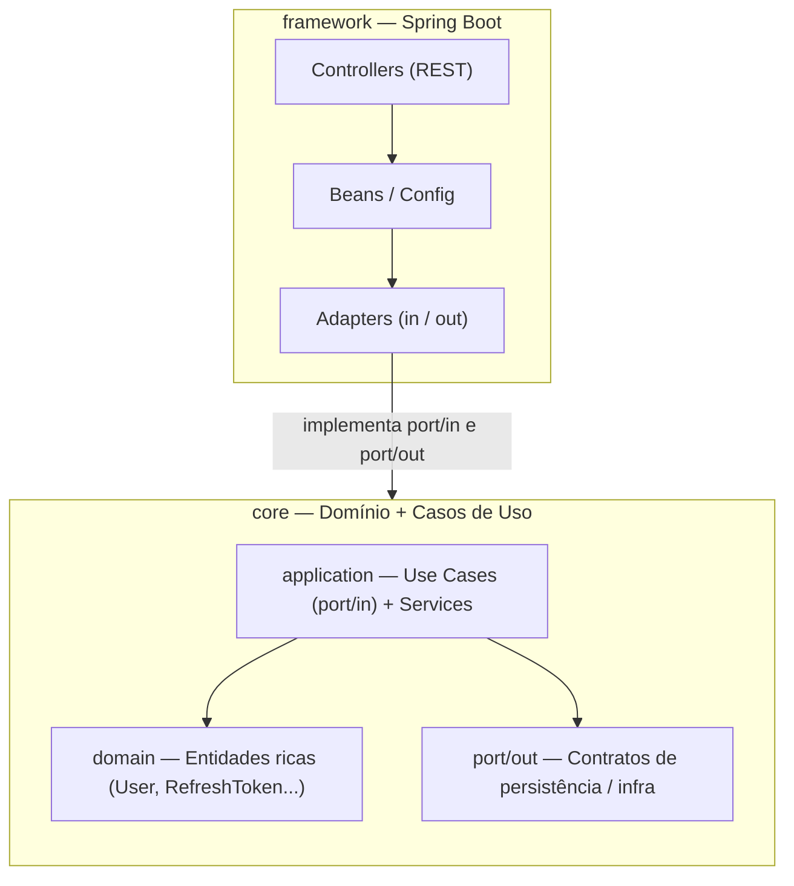

# Auth API Sample

Uma API de autenticação e autorização construída em **Java 21 + Spring Boot**, aplicando **Clean Architecture**, **Arquitetura Hexagonal (Ports & Adapters)** e princípios de **Domain-Driven Design (DDD)**.

O projeto nasceu como o módulo de autenticação de uma plataforma financeira maior, e foi extraído aqui como um **sample/portfólio** para demonstrar como estruturar uma API de auth robusta, segura e desacoplada de frameworks.

<p>
  
  
  
  
  
  
  
</p>

---

## Sumário

- [Sobre o projeto](#sobre-o-projeto)
- [Arquitetura](#arquitetura)
- [Stack tecnológica](#stack-tecnológica)
- [Funcionalidades](#funcionalidades)
- [Estrutura de pastas](#estrutura-de-pastas)
- [Endpoints](#endpoints)
- [Segurança](#segurança)
- [Como executar localmente](#como-executar-localmente)
- [Documentação da API](#documentação-da-api)
- [CI/CD](#cicd)
- [Licença](#licença)

---

## Sobre o projeto

O **Auth API Sample** implementa um fluxo completo de autenticação stateless com **JWT + Refresh Token rotativo**, cadastro com **verificação de e-mail via código OTP**, controle de sessões (revogação individual) e **autorização baseada em papéis (RBAC)** com uma anotação customizada.

O foco do projeto não é só "fazer login funcionar", mas mostrar como organizar uma API real:

- Regras de negócio isoladas de qualquer detalhe de framework (Spring, JPA, JWT etc. são só *detalhes de infraestrutura*);
- Casos de uso explícitos (`UseCase` por operação), fáceis de testar e de ler;
- Segurança pensada de ponta a ponta (cookies `httpOnly`, hashing de tokens, CSRF, bcrypt configurável);
- Pipeline de CI/CD com build, análise estática (CodeQL) e scan de vulnerabilidades de container (Grype).

## Arquitetura

O projeto é um **multi-módulo Maven** dividido em duas responsabilidades bem separadas, seguindo Clean Architecture / Ports & Adapters:



- **`core`** — módulo puro em Java (sem Spring), contendo o domínio (`domain`), as regras de negócio (`application/service`) e os contratos (`port/in` para casos de uso e `port/out` para infraestrutura). Só depende do Lombok.
- **`framework`** — módulo Spring Boot responsável por *implementar* os contratos definidos no `core`: controllers REST, adapters JPA, geração/validação de JWT, envio de e-mail, configuração de segurança, tratamento global de exceções etc.

Essa separação garante que as regras de autenticação (ex.: "refresh token expirado deve ser revogado", "e-mail precisa estar verificado para logar") não conheçam Spring, banco de dados ou HTTP — elas podem ser testadas isoladamente e até migradas para outro framework sem reescrever a lógica de negócio.

## Stack tecnológica

| Categoria             | Tecnologia                                                        |
|------------------------|--------------------------------------------------------------------|
| Linguagem              | Java 21                                                            |
| Framework              | Spring Boot 4.1 (Web MVC, Data JPA, Validation, Mail, Actuator)    |
| Segurança              | Spring Security, JWT (`java-jwt` / Auth0), BCrypt, SHA-256          |
| Banco de dados         | PostgreSQL 18                                                      |
| ORM                    | Hibernate / Spring Data JPA                                        |
| Templates de e-mail    | Thymeleaf                                                          |
| Documentação de API    | springdoc-openapi + Scalar UI                                     |
| Build                  | Maven (multi-módulo)                                               |
| Containerização        | Docker (multi-stage build)                                         |
| CI/CD                  | GitHub Actions (CI, CodeQL, Grype, Deploy)                          |
| Boilerplate            | Lombok                                                             |

## Funcionalidades

- **Cadastro (Sign Up)** com hashing de senha (BCrypt) e envio de **código OTP** por e-mail para verificação de conta.
- **Verificação de e-mail** com o código OTP, ativando a conta e já criando uma sessão autenticada.
- **Login (Sign In)** com geração de **Access Token (JWT)** de curta duração e **Refresh Token** de longa duração, entregues via cookies `httpOnly`/`secure`/`SameSite=Strict`.
- **Refresh de sessão** com rotação e validação de refresh token contra hash armazenado no banco.
- **Logout** com revogação do refresh token atual.
- **Revogação de sessão específica** (`DELETE /sessions/revoke/{sessionId}`), permitindo ao usuário encerrar sessões individuais (ex.: "sair de outro dispositivo").
- **Autorização por papéis (RBAC)** com uma anotação própria `@RequiredRole(...)`, resolvida por um `AuthorizationManager` customizado registrado via `@EnableMethodSecurity` — sem depender apenas do `@PreAuthorize` com SpEL.
- **Notificações por e-mail** de novo login (com IP e dispositivo) e de conta criada, usando templates Thymeleaf.
- **Tratamento global de exceções** (`@RestControllerAdvice`) com payload de erro padronizado, incluindo os pontos de entrada de autenticação/autorização do Spring Security (`AuthenticationEntryPoint` / `AccessDeniedHandler`).

## Estrutura de pastas

```
auth-api-sample/
├── core/                         # Domínio + regras de negócio (framework-agnostic)
│   └── src/main/java/com/auth/core/
│       ├── auth/
│       │   ├── domain/            # RefreshToken, EmailVerificationToken
│       │   └── application/
│       │       ├── port/in/       # Use Cases (SignIn, SignUp, RefreshToken...)
│       │       ├── port/out/      # Contratos de persistência/infra
│       │       └── service/       # Implementação das regras de negócio
│       ├── user/
│       │   ├── domain/            # User
│       │   └── application/       # Use Cases + Services de usuário
│       └── shared/                # Exceptions, enums (Roles), e-mail, transação
│
└── framework/                    # Camada de infraestrutura (Spring Boot)
    └── src/main/java/com/auth/api/framework/
        ├── auth/
        │   ├── adapter/port/in/web/   # AuthController, SessionController
        │   ├── adapter/port/out/      # Adapters JPA (RefreshToken, EmailVerification)
        │   └── utils/                 # JWT, hashing, BCrypt, geração de tokens
        ├── user/                      # UserController + adapters de persistência
        └── shared/
            ├── config/security/       # SecurityConfig, SecurityFilter, RBAC custom
            ├── config/openApi/        # Configuração do Swagger/Scalar
            └── handler/                # GlobalExceptionHandler
```

## Endpoints

Todas as rotas usam o prefixo de contexto `/api/v1`.

| Método   | Rota                              | Descrição                                             | Autenticação |
|----------|------------------------------------|--------------------------------------------------------|:------------:|
| `POST`   | `/auth/sign-up`                    | Cria um usuário e envia código OTP por e-mail          | Pública      |
| `POST`   | `/auth/verify-email`               | Verifica o código OTP e autentica o usuário             | Pública      |
| `POST`   | `/auth/sign-in`                    | Autentica o usuário e cria uma sessão                   | Pública      |
| `POST`   | `/sessions/refresh`                | Gera um novo access token a partir do refresh token     | Pública*     |
| `POST`   | `/sessions/logout`                 | Revoga a sessão atual e limpa os cookies                | Pública*     |
| `DELETE` | `/sessions/revoke/{sessionId}`     | Revoga uma sessão específica do usuário autenticado     | JWT          |
| `GET`    | `/users`                           | Endpoint de exemplo restrito a `ADMIN`                  | JWT + RBAC   |

`*` Não exigem o access token, mas dependem do refresh token válido enviado via cookie.

## Segurança

- **JWT (HMAC256)** para access token, com `issuer`, `subject` (id do usuário) e `role` como claim, tempo de expiração configurável.
- **Refresh Token opaco**, gerado aleatoriamente e armazenado **apenas como hash** (nunca em texto puro) — mesmo padrão aplicado ao código OTP de verificação de e-mail.
- **BCrypt** com *strength* configurável via variável de ambiente para hashing de senha.
- **Cookies `httpOnly` + `secure` + `SameSite=Strict`** para access e refresh tokens, mitigando XSS e CSRF na entrega dos tokens.
- **Proteção CSRF** via `CookieCsrfTokenRepository`, com exceções apenas para os endpoints públicos de autenticação.
- **Filtro de autenticação próprio** (`SecurityFilter extends OncePerRequestFilter`) que valida o JWT do cookie e popula o `SecurityContext`.
- **RBAC declarativo customizado**: anotação `@RequiredRole(Roles.ADMIN)` interpretada por um `AuthorizationManager` registrado como interceptor de método (`AuthorizationManagerBeforeMethodInterceptor`).
- **Tratamento centralizado de erros de autenticação/autorização**, sem vazar detalhes internos nas respostas.

## Como executar localmente

### Pré-requisitos

- Java 21+
- Docker e Docker Compose
- Conta de e-mail SMTP (ex.: Gmail com senha de app) para o envio de OTP/notificações

### Passo a passo

```bash
# 1. Clone o repositório
git clone https://github.com/gustavoventieri/auth-api-sample.git
cd auth-api-sample

# 2. Configure as variáveis de ambiente
cp framework/.env.properties.example framework/.env.properties
# edite framework/.env.properties com suas credenciais (DB, JWT, SMTP...)

# 3. Suba o banco de dados PostgreSQL
docker compose up -d postgres

# 4. Rode a aplicação (via Maven Wrapper, dentro do módulo framework)
cd framework
./mvnw spring-boot:run
```

A API sobe em `http://localhost:8080/api/v1` (porta configurável via `APP_PORT`).

Alternativamente, é possível construir e rodar tudo via Docker:

```bash
docker build -t auth-api-sample .
docker run --env-file framework/.env.properties -p 8080:8080 auth-api-sample
```

## Documentação da API

Com a aplicação em execução, a documentação interativa (Scalar UI, baseada no OpenAPI) fica disponível em:

```
http://localhost:8080/api/v1/scalar
```

## CI/CD

O projeto conta com um pipeline no GitHub Actions (`.github/workflows/pipeline.yaml`), disparado a cada push na `master`, que orquestra:

- **CI** — build da imagem Docker e execução dos testes;
- **CodeQL** — análise estática de segurança do código;
- **Container Security (Grype)** — scan de vulnerabilidades na imagem Docker gerada;
- **Deploy** — publicação da aplicação.

## Licença

Distribuído sob a licença MIT. Veja o arquivo [`LICENSE`](LICENSE) para mais detalhes.
